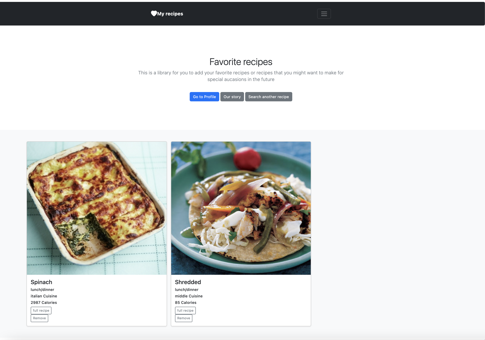
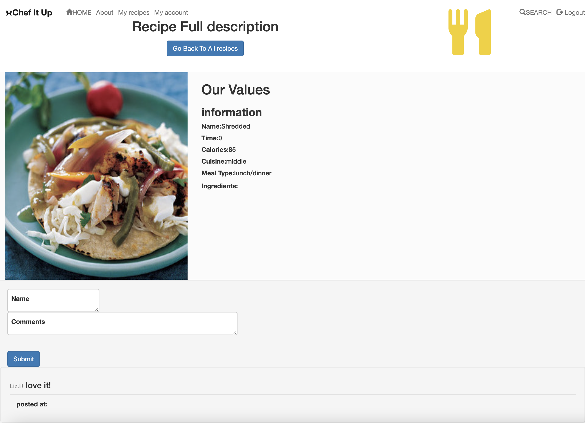

# Chef It Up 

This app was made to create a quick and easy way for people who love or want to cook more from home to be able to access a variety of recipes. 

#### Backstory: BlogPulse

As a recent college graduate, I found myself for the first time in a situation where I was at home alone having to cook for myself every day. Not only did I start to run out of ideas, the ingredients in my fridge often went to waste and I ended up ordering food online, which is both expensive and unhealthy. Through this app I hope that other people in similar situation as me can find it easy to access many different recipes out there. 


## What it includes

* Sequelize user model / migration
* Settings for PostgreSQL
* Passport and passport-local for authentication
* Sessions to keep user logged in between pages
* Flash messages for errors and successes
* Passwords that are hashed with BCrypt
* EJS Templating and EJS Layouts
* CSS 
* Bootstrap
* ORM


### User Model

| Column Name | Data Type | Notes |
| --------------- | ------------- | ------------------------------ |
| id | Integer | Serial Primary Key, Auto-generated |
| name | String | Must be provided |
| email | String | Must be unique / used for login |
| password | String | Stored as a hash |
| createdAt | Date | Auto-generated |
| updatedAt | Date | Auto-generated |

### Default Routes

| Method | Path | Location | Purpose |
| ------ | ---------------- | -------------- | ------------------- |
| GET | / | server.js | Home page |
| GET | /auth/login | auth.js | Login form |
| GET | /auth/signup | auth.js | Signup form |
| POST | /auth/login | auth.js | Login user |
| POST | /auth/signup | auth.js | Creates User |
| GET | /auth/logout | auth.js | Removes session info |
| PUT| /edit | server.js | user can edit their name/email |
| DELETE | /recipes | recipes.js | User can delete recipe from database |
| POST | /:id/comment | recipes.js | user can add comment on individual recipes |

## User Stories db

As a new member of cooking from home team I want to be able to
    1. Search up food recepies based on my current diet 
    2. Save my favorite recipies for future use 
    3. Comment on recipes and delete recipes I no longer need from my favorite list 


## `1` Fork & Clone Project & Install Dependencies
`1` The first thing that we are going to do is `fork` and `clone`

`2` Now we are going to install the current dependencies that are listed inside of `package.json`
```text
npm install
```

`3` We need to install some packages that will be used for `authentication`. Those are the following packages:

```text
npm install bcryptjs connect-flash passport passport-local express-session method-override
```
-  [bcryptjs](https://www.npmjs.com/package/bcryptjs): A library to help you hash passwords. ( [wikipedia](https://en.wikipedia.org/wiki/Bcrypt) ) 
    - Blowfish has a 64-bit block size and a variable key length from 32 bits up to 448 bits.
- [connect-flash](https://github.com/jaredhanson/connect-flash): The flash is an area of the session used for storing messages that will be used to to display to the user. Flash is typically used with redirects.
- [passport](https://www.passportjs.org/docs/): Passport is authentication middleware for Node.js. It is designed to do one thing authenticate requests. There are over 500+ strategies used to authenticate a user; however, we will be using one - *passport-local* Passport is authentication middleware for Node. It is designed to serve a singular purpose: authenticate requests
- [passport-local](http://www.passportjs.org/packages/passport-local/): The local authentication strategy authenticates users using a username and password. The strategy requires a verify callback, which accepts these credentials and calls done providing a user. [passport-local](http://www.passportjs.org/packages/passport-local/)
- [express-session](https://github.com/expressjs/session): Create a session middleware with given *options*.
- [method-override](https://github.com/expressjs/method-override): Lets you use HTTP verbs such as PUT or DELETE in places where the client doesn't support it.

`4` Make a commit

```text
git add .
git commit -m "Install dependencies for project"
```
## The APP 






<!-- 
## `2` Create Database & Update Sequelize Config

`1` Update **`config.json`** file with the following:

```json
{
  "development": {
    "database": "express_auth_dev",
    "host": "127.0.0.1",
    "dialect": "postgres"
  },
  "test": {
    "database": "express_auth_test",
    "host": "127.0.0.1",
    "dialect": "postgres"
  },
  "production": {
    "use_env_variable": "DATABASE_URL",
    "dialect": "postgres",
    "dialectOptions": {
        "ssl": {
          "require": true,
          "rejectUnauthorized": false
        }
    }
  }
}
```

`2` Create database `express_auth_dev`

```text
sequelize db:create
```


## `3` Analyze File Structure

```text
├── config
│   └── config.json
├── controllers
│   └── auth.js
├── models
│   └── index.js
├── node_modules
│   └── ...
├── public
│   └── assets
│   └── css
│       └── style.css
├── test
│   └── auth.test.js
│   └── index.test.js
│   └── profile.test.js
│   └── user.test.js
├── views
│   └── auth
│       └── login.ejs
│       └── signup.ejs
│   └── index.ejs
│   └── layout.ejs
│   └── profile.ejs
├── .gitignore
├── package-lock.json
├── package.json
├── README.md
├── server.js
```

- `config.json`: Where you need to configure your project to interact with your postgres database.
- `controllers`: The folder where all of your controllers ( routes ) will go to control the logic of your app.
- `models`: The folder where all the models will be stored that will interact with the database.
- `node_modules`: The folder that is generated by **npm** that stores the source code for all dependencies installed.
- `public`: is to have those views that would be publicly accessible in the application. ex. `style.css`
- `test`: The folder where all your test that you make will be stored. ex. `auth.test.js`
- `views`: The folder where all the app's templates will be stored for displaying pages to the user. ex. `login.ejs`
- `.gitignore`: A hidden file that will hide and prevent any files with to NOT get pushed to Github.
- `package-lock.json`: is automatically generated for any operations where npm modifies either the `node_modules` tree, or `package.json`.
- `package.json`: The settings file that stores scripts and list of dependencies that are used inside your app.
- `README.md`: The main markdown file that written to explain the details your app.
- `server.js`: The main file that controls the entire application.

## `4` Create `user` Model & Add Validations

`1` Add `user` model

```text
sequelize model:create --name user --attributes name:string,email:string,password:string
```

`2` Add **validations** for `user` model

Validations are used as constraints for a column in a table that requires an entry in the database to follow various rules set in order for that data to be entered into the database.

```js
'use strict';

const {
  Model
} = require('sequelize');
module.exports = (sequelize, DataTypes) => {
  class user extends Model {
    /**
     * Helper method for defining associations.
     * This method is not a part of Sequelize lifecycle.
     * The `models/index` file will call this method automatically.
     */
    static associate(models) {
      // define association here
    }
  };
  user.init({
    name: {
      type: DataTypes.STRING,
      validate: {
       len: {
        args: [1,99],
        msg: 'Name must be between 1 and 99 characters'
       }
      }
    },
    email: {
      type: DataTypes.STRING,
      validate: {
        isEmail: {
          msg: 'Invalid email'
        }
      }
    },
    password: {
      type: DataTypes.STRING,
      validate: {
        len: {
          args: [8,99],
          msg: 'Password must be between 8 and 99 characters'
        }
      }
    }
  }, {
    sequelize,
    modelName: 'user',
  });

  return user; // add functions above 
};
```

`3` Make a *commit* message
```text
git add .
git commit -m "add: user model and validations"
```

## `5` Add Methods to `user` Model to Hash Password, Etc.

`1` Import `bcrypt` at the top of `user` model
```js
const bcrypt = require('bcryptjs');
```

`2` Create a hook `beforeCreate` to hash **password** inside `user` model before it enters the database

Inside of the user model, add the following hook to hash password

```js
// Before a user is created, we are encrypting the password and using hash in its place
user.addHook('beforeCreate', (pendingUser) => { // pendingUser is user object that gets passed to DB
    // Bcrypt is going to hash the password
    let hash = bcrypt.hashSync(pendingUser.password, 12); // hash 12 times
    pendingUser.password = hash; // this will go to the DB
});  
```

`3` Add `validPassword()` method to `user` model that will compare a password entered with the hashed password

```js
 // Check the password on Sign-In and compare it to the hashed password in the DB
user.prototype.validPassword = function(typedPassword) {
    let isCorrectPassword = bcrypt.compareSync(typedPassword, this.password); // check to see if password is correct.

    return isCorrectPassword;
}
```

`4` Add `toJSON()` method to `user` model that will delete password to prevent from being used on the client

```js
// return an object from the database of the user without the encrypted password
user.prototype.toJSON = function() {
    let userData = this.get(); 
    delete userData.password; // it doesn't delete password from database, only removes it. 
    
    return userData;
}
```

`5` Verify that model looks like the following code snippet ( [here](https://github.com/romebell/express_authentication/blob/main/solutions.md#1-userjs) )

`6` Do a migration

```text
sequelize db:migrate
```

## `6` Add `SECRET SESSION` and Flash to App

`1` Create a `.env` file and place an evironment variable `SECRET_SESSION` with the string of your choice

```env
SECRET_SESSION=alldayidreamaboutsoftwareengineering
```

`2` Add `.env` to .gitignore file

`3` Import the `connect-flash` and `express-session` under the imports inside the server file
```js
const session = require('express-session');
const flash = require('connect-flash');
```

`4` Add `SECRET_SESSION` variable that will be a reference to the environment variable set in step `1`. Print to make sure the variable is displaying inside the **terminal**

```js
const SECRET_SESSION = process.env.SECRET_SESSION;
// console.log(SECRET_SESSION);
```

`5` Add session and flash middleware to be used throughout app inside `server.js`

Add below the current middleware is located ( before routes )
```js
app.use(flash());            // flash middleware

app.use(session({
  secret: SECRET_SESSION,    // What we actually will be giving the user on our site as a session cookie
  resave: false,             // Save the session even if it's modified, make this false
  saveUninitialized: true    // If we have a new session, we save it, therefore making that true
}));


```

`7` Add **function**  as middle to store flash messages and user on `res.locals` 
```js
app.use((req, res, next) => {
  console.log(res.locals);
  res.locals.alerts = req.flash();
  res.locals.currentUser = req.user;
  next();
});
```

`8` Make *commit* message
```text
git add .
git commit -m "Create env variable and add session and flash middleware" 
```

## `7` Create Passport Configuration

`1` Create a file called `ppConfig.js` inside of the `config` folder

`2` Import `passport`, `passport-local` and the `database` into **`ppConfig.js`** file
```js
const passport = require('passport');
const LocalStrategy = require('passport-local').Strategy;

// Database
const db = require('../models');
```

`3` Create a new instance of a `LocalStrategy`

```js
const STRATEGY = new LocalStrategy({
    usernameField: 'email',         // looks for an email field as the username
    passwordField: 'password'       // looks for an password field as the password
    }, async (email, password, cb) => {
        try {
            const user = await db.user.findOne({
                where: { email }
            });

            if (!user || !user.validPassword(password)) { 
                cb(null, false);     // if no user or invalid password, return false
            } else {
                cb(null, user);
            }
        } catch (err) {
            console.log('------- Error below -----------');
            console.log(err);
        }
})
```

`4` Serialize User with Passport in order to login

```js
// Passport "serialize" info to be able to login
passport.serializeUser((user, cb) => {
    cb(null, user.id);
});
```

`5` Deserialize user and return user if found by `id`

```js
passport.deserializeUser(async (id, cb) => {
    try {
        const user = await db.user.findByPk(id);

        if (user) {
            cb(null, user)
        }
    } catch (err) {
        console.log('---- Yo... There is an error ----');
        console.log(err);
    }
});
```

`6` Use new instance of `LocalStrategy` inside of Passport as middleward

```js
passport.use(STRATEGY);
```

`7` Export passport from `ppConfig.js`

```js
module.exports = passport;
```

`8` Make *commit* message
```text
git add .
git commit -m "ppConfig: Create passport configuration" 
```

## `8` Import Passport Config and Initialize
After making local strategy for passport, we now need to import the **`ppConfig.js`** file into the server, initialize and use it as middleware throughout the app.

`1` Import the `ppConfig.js` file like so with other imports inside server

```js
const passport = require('./config/ppConfig');
```

`2` Initialize passport and passport session, invoke it, and pass through as middleware. Place this between the middleware that invokes **`flash`** and the middleware that is using **`res.locals`**.

```js
app.use(passport.initialize());      // Initialize passport
app.use(passport.session());         // Add a session
```

It should be placed on the server like so:

```js
app.use(flash());

app.use(passport.initialize());
app.use(passport.session());

app.use((req, res, next) => {
  console.log(res.locals);
  res.locals.alerts = req.flash();
  res.locals.currentUser = req.user;
  next();
});
```

`3` Import the `ppConfig.js` file inside of `auth.js` located in the **`controllers`** folder

```js
const passport = require('../config/ppConfig');
```

`4` Make *commit* message
```text
git add .
git commit -m "server: Import passport and pass through middleware" 
```

## `9` Add `isLoggedIn` Middleware

The purpose of this middleware will be to check to see if a user is logged in before they are allowed to have a access to a specific route. This middleware will be place inside a route between the route ( `/profile` ) and the callback with the request ( `req` ), and response ( `res` ) parameters inside.

`1` Create a folder called `middleware` on the top level.

`2` Create a file inside of the **`middleware`** folder called `isLoggedIn.js`.

`3` Add a function **`isLoggedIn()`** that take in 3 params: `req`, `res`, and `next`.

```js
function isLoggedIn(req, res, next) {
    if (!req.user) {
        req.flash('error', 'You must be signed in to access page');
        res.redirect('/auth/login');
    } else {
        next();
    }
}
```

`4` Export the function

```js
module.exports = isLoggedIn;
```

`5` Import `isLoggedIn` inside of **`server.js`**
```js
const isLoggedIn = require('./middleware/isLoggedIn');
```

`6` Make *commit* message
```text
git add .
git commit -m "isLoggedIn: add middleware and import to server" 
```

## `10` Make Login `/POST` Route
We need now to make a `/POST` for the data that get submitted with the 
**login** form. The **`action`** in the fom specifies the route **`/auth/login`** that needs to be made for the data to go to. The data that is submitted will be check against the database to validity before being logged into the app.

The form that the data will be submitted from:
```ejs
<form action="/auth/login" method="POST">
  <label for="auth-email">Email</label>
  <input id="auth-email" type="email" name="email" required>

  <label for="auth-password">Password</label>
  <input id="auth-password" type="password" name="password" required>

  <input type="submit" value="Log In">
</form>
```

`1` Create a **`post`** route for login. All the methods that are given for the `/login` post route are Passport's way of authenticating a user
```js
router.post('/login', passport.authenticate('local', {
  successRedirect: '/',
  failureRedirect: '/auth/login',
  successFlash: 'Welcome back ...',
  failureFlash: 'Either email or password is incorrect' 
}));
```

`2` Run **`mocha`** to see how many tests passed

`3` Make *commit* message
```text
git add .
git commit -m "auth: add login post route"
```

## `11` Make Signup `/POST` Route
We need now to make a `/POST` route for the data that get submitted with the **signup** form. The **`action`** in the fom specifies the route that needs to be made for the data to go to. The data that is submitted will be used to create a new user and added to the database. After signing up user, we will redirect them back to the login page to login.

The form that the data will be submitted from:
```ejs
<form action="/auth/signup" method="POST">
  <label for="new-email">Email</label>
  <input id="new-email" type="email" name="email" required>

  <label for="new-name">Name</label>
  <input id="new-name" type="text" name="name" required>

  <label for="new-password">Password</label>
  <input id="new-password" type="password" name="password" required>

  <input type="submit" value="Sign up">
</form>
```
`1` Import **`database`** into `auth.js` file
```js
const db = require('../models');
```

`2` Create a **`post`** route for signup

```js
router.post('/signup', async (req, res) => {
  // we now have access to the user info (req.body);
  const { email, name, password } = req.body; // goes and us access to whatever key/value inside of the object
  try {
    const [user, created] = await db.user.findOrCreate({
        where: { email },
        defaults: { name, password }
    });

    if (created) {
        // if created, success and we will redirect back to / page
        console.log(`----- ${user.name} was created -----`);
        const successObject = {
            successRedirect: '/',
            successFlash: `Welcome ${user.name}. Account was created and logging in...`
        }
        // 
        passport.authenticate('local', successObject)(req, res);
    } else {
      // Send back email already exists
      req.flash('error', 'Email already exists');
      res.redirect('/auth/signup'); // redirect the user back to sign up page to try again
    }
  } catch (error) {
        // There was an error that came back; therefore, we just have the user try again
        console.log('**************Error');
        console.log(error);
        req.flash('error', 'Either email or password is incorrect. Please try again.');
        res.redirect('/auth/signup');
  }
});
```

`3` Run **`mocha`** to see how many tests passed

`4` Make *commit* message
```text
git add .
git commit -m "auth: add signup post route"
```

## `12` Make `logout` /GET Route
The purpose of this route is to log the user out of the app. The main part of this route will be a built in function provided by request ( `req` ) that would do this: **`req.logout()`**. Then we will display a flash message to the user letting them know that they logged out. Lastly, we will direct the user back to the home page ( `/` ) like the majority of apps do after logging out.

`1` Create `/logout` route to log user out

```js
router.get('/logout', (req, res) => {
  req.logOut(); // logs the user out of the session
  req.flash('success', 'Logging out... See you next time!');
  res.redirect('/');
});
```

`2` Run **`mocha`** to see how many tests passed

`3` Make *commit* message
```text
git add .
git commit -m "auth: add logout get route"
```

## `13` Create Partials For Alerts
The purpose of these partials ( `views` ) is to render the `flash` alerts to the frontend. There will be some logic written out to display to the user is they may have gotten the password incorrect or that they were successful in logging in. We will be adding these partials to the **`layout.ejs`** page.

`1` Create a folder called **`partials`** inside of the `views` folder

`2` Create a file called **`alerts.ejs`** inside of the `partials` folder

`3` Create two conditionals that will look for `error` flash messages or `success` flash messages that were created in various routes. We will be adding classes on these messages to display in **green** for success messages and **red** for error messages -->
