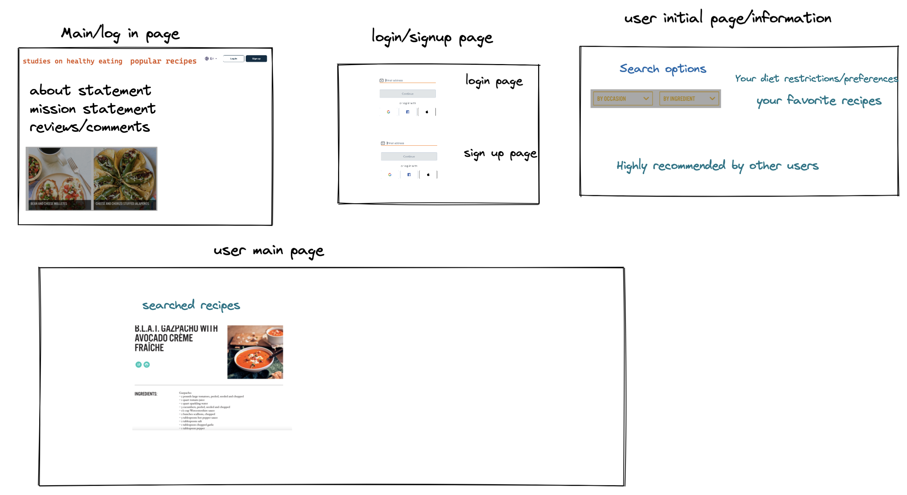
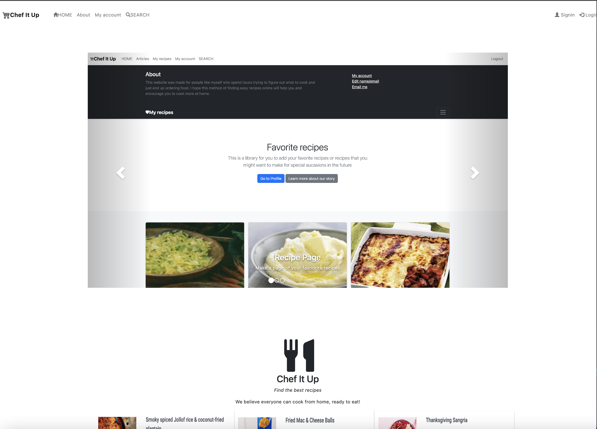

# Chef It Up 

This app was made to create a quick and easy way for people who love or want to cook more from home to be able to access a variety of recipes. 

#### Backstory: BlogPulse

As a recent college graduate, I found myself for the first time in a situation where I was at home alone having to cook for myself every day. Not only did I start to run out of ideas, the ingredients in my fridge often went to waste and I ended up ordering food online, which is both expensive and unhealthy. Through this app I hope that other people in similar situation as me can find it easy to access many different recipes out there. 


## What it includes

* Sequelize user model / migration
* Settings for PostgreSQL
* Passport and passport-local for authentication
* Sessions to keep user logged in between pages
* Flash messages for errors and successes
* Passwords that are hashed with BCrypt
* EJS Templating and EJS Layouts
* CSS 
* Bootstrap
* ORM


### User Model

| Column Name | Data Type | Notes |
| --------------- | ------------- | ------------------------------ |
| id | Integer | Serial Primary Key, Auto-generated |
| name | String | Must be provided |
| email | String | Must be unique / used for login |
| password | String | Stored as a hash |
| createdAt | Date | Auto-generated |
| updatedAt | Date | Auto-generated |

### Default Routes

| Method | Path | Location | Purpose |
| ------ | ---------------- | -------------- | ------------------- |
| GET | / | server.js | Home page |
| GET | /auth/login | auth.js | Login form |
| GET | /auth/signup | auth.js | Signup form |
| POST | /auth/login | auth.js | Login user |
| POST | /auth/signup | auth.js | Creates User |
| GET | /auth/logout | auth.js | Removes session info |
| PUT| /edit | server.js | user can edit their name/email |
| DELETE | /recipes | recipes.js | User can delete recipe from database |
| POST | /:id/comment | recipes.js | user can add comment on individual recipes |

## User Stories db

As a new member of cooking from home team I want to be able to
    1. Search up food recepies based on my current diet 
    2. Save my favorite recipies for future use 
    3. Comment on recipes and delete recipes I no longer need from my favorite list 


## `1` Fork & Clone Project & Install Dependencies
`1` The first thing that we are going to do is `fork` and `clone`

`2` Now we are going to install the current dependencies that are listed inside of `package.json`
```text
npm install
```

`3` We need to install some packages that will be used for `authentication`. Those are the following packages:

```text
npm install bcryptjs connect-flash passport passport-local express-session method-override
```
-  [bcryptjs](https://www.npmjs.com/package/bcryptjs): A library to help you hash passwords. ( [wikipedia](https://en.wikipedia.org/wiki/Bcrypt) ) 
    - Blowfish has a 64-bit block size and a variable key length from 32 bits up to 448 bits.
- [connect-flash](https://github.com/jaredhanson/connect-flash): The flash is an area of the session used for storing messages that will be used to to display to the user. Flash is typically used with redirects.
- [passport](https://www.passportjs.org/docs/): Passport is authentication middleware for Node.js. It is designed to do one thing authenticate requests. There are over 500+ strategies used to authenticate a user; however, we will be using one - *passport-local* Passport is authentication middleware for Node. It is designed to serve a singular purpose: authenticate requests
- [passport-local](http://www.passportjs.org/packages/passport-local/): The local authentication strategy authenticates users using a username and password. The strategy requires a verify callback, which accepts these credentials and calls done providing a user. [passport-local](http://www.passportjs.org/packages/passport-local/)
- [express-session](https://github.com/expressjs/session): Create a session middleware with given *options*.
- [method-override](https://github.com/expressjs/method-override): Lets you use HTTP verbs such as PUT or DELETE in places where the client doesn't support it.

`4` Make a commit

```text
git add .
git commit -m "Install dependencies for project"
```

## Wireframe


## The APP 



## Future Improvements
- Make sure all the data sets from the API can be migrated into my database in correct format.
- Add more features within the App so that the user can create a weekly meal plan for the week.
- Allow user to add their own recipe with a create recipe form  
- Make better styling for the 'My recipes" page so that it looks like the example format on screenshots in the home page. 


